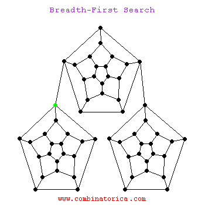
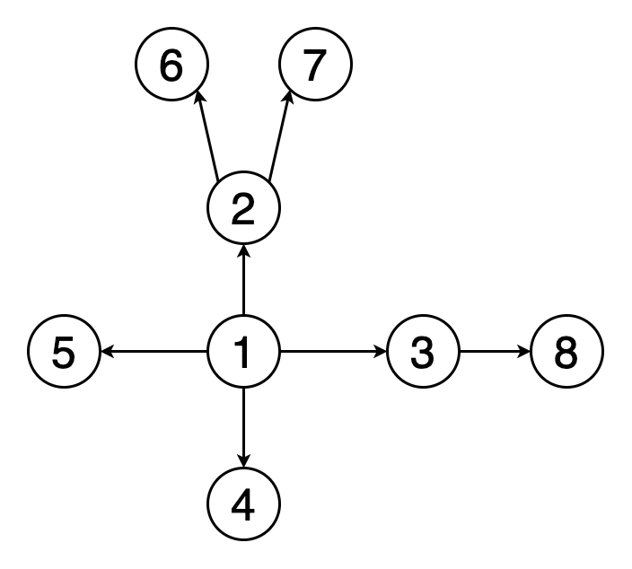

## Adjacency list and matrix (Репрезентации матрицы 3 способа)

Графы:

https://rpruim.github.io/m252/S19/from-class/graphs/introduction-to-graphs.html


**Adjacency list**


```c++
#include <iostream>
#include <vector>
#include <queue>

using namespace std;

class Graph {
private:
    int vertices;
    vector<vector<int>> adjList;

public:
    Graph(int V) : vertices(V), adjList(V) {}

    void addEdge(int v, int w) {
        adjList[v].push_back(w);
        adjList[w].push_back(v);
    }

    void printAdjList() {
        for (int i = 0; i < vertices; ++i) {
            cout << "Adjacency list of vertex " << i << ": ";
            for (const auto &neighbor : adjList[i]) {
                cout << neighbor << " ";
            }
            cout << endl;
        }
    }

    void BFS(int startVertex) {
        vector<bool> visited(vertices, false); // те вершины которые посещены и их не нужно посещать
        queue<int> bfsQueue; // буферная куча вершин которых нужно посетить

        visited[startVertex] = true; // делаем начальный "посященным"
        bfsQueue.push(startVertex); // запихиваем его в буфер

        cout << "BFS starting from vertex " << startVertex << ": "; 

        while (!bfsQueue.empty()) { // пока буферная куча не будет пуста
            int currentVertex = bfsQueue.front(); // текущая посещаемая вершина это первый элемент буфера , в следующей итерации он измениться на следующую в буфере то есть следующая будет первой изза нижней операции
            bfsQueue.pop(); удаляем превый элемент в буфере

            cout << currentVertex << " "; // используем текущий

            for (const auto &neighbor : adjList[currentVertex]) { // ищем соседей те детей , тех которые дети текущего проходясь по всем вершинам с условием которое ниже
                if (!visited[neighbor]) { // если вершина не посещена
                    visited[neighbor] = true; // ставим ее как посещенной чтобы этот процесс заново не закинул его в буферную кучу
                    bfsQueue.push(neighbor); // добавляем ребенка те соседа в кучу 
                }
            }
        }

        cout << endl;
    }
};

int main() {
    int vertices = 5;
    Graph graph(vertices);

    graph.addEdge(0, 1);
    graph.addEdge(0, 4);
    graph.addEdge(1, 2);
    graph.addEdge(1, 3);
    graph.addEdge(1, 4);
    graph.addEdge(2, 3);
    graph.addEdge(3, 4);

    graph.printAdjList();

    graph.BFS(0); // Start BFS from vertex 0

    return 0;
}

```


```c++
    void addEdge(int v, int w) { 
        adjList[v].push_back(w);
        adjList[w].push_back(v); 
    }
```
при создании графа в нем будет V вершин , и не более V векторов или связанных списков 
для v того вектора или связанного списка добавить w
для w того вектора или связанного списка добавить v


для понимания : 

https://www.youtube.com/watch?v=ee6zIj4J3-Y  

https://www.youtube.com/watch?v=dhgKr8942rs


**Adjacency matrix**


```c++

#include <iostream>
#include <vector>
#include <queue>

using namespace std;

class Graph {
private:
    int vertices;
    vector<vector<int>> adjMatrix;

public:
    Graph(int V) : vertices(V), adjMatrix(V, vector<int>(V, 0)) {}

    void addEdge(int v, int w) {
        adjMatrix[v][w] = 1;
        adjMatrix[w][v] = 1; // Uncomment for undirected graph
    }

    void printAdjMatrix() {
        for (int i = 0; i < vertices; ++i) {
            for (int j = 0; j < vertices; ++j) {
                cout << adjMatrix[i][j] << " ";
            }
            cout << endl;
        }
    }

    void BFS(int startVertex) {
        vector<bool> visited(vertices, false);
        queue<int> bfsQueue;

        visited[startVertex] = true;
        bfsQueue.push(startVertex);

        cout << "BFS starting from vertex " << startVertex << ": ";

        while (!bfsQueue.empty()) {
            int currentVertex = bfsQueue.front(); // следующий который нужно посетить (текущий)
            bfsQueue.pop(); // убираем посещенный (старый первый) элемент из буферной кучи

            cout << currentVertex << " ";

            for (int i = 0; i < vertices; ++i) { // для всех вершин которые:
                if (adjMatrix[currentVertex][i] == 1 && !visited[i]) { // для вершин которые не посещены и дети текущего
                    visited[i] = true; // делаем детей посещенными
                    bfsQueue.push(i);  //пихаем их в очередь
                }
            }
        }

        cout << endl;
    }
};

int main() {
    int vertices = 5; // Change this as needed
    Graph graph(vertices);

    // Add edges
    graph.addEdge(0, 1);
    graph.addEdge(0, 4);
    graph.addEdge(1, 2);
    graph.addEdge(1, 3);
    graph.addEdge(1, 4);
    graph.addEdge(2, 3);
    graph.addEdge(3, 4);

    // Print adjacency matrix
    graph.printAdjMatrix();

    graph.BFS(0);
    return 0;
}


```

для понимания: https://www.youtube.com/watch?v=B28xAWEerK8

**Edge list**


```c++
#include <iostream>
#include <vector>
#include <queue>

using namespace std;

class Edge {
public:
    int source, destination, weight;

    Edge(int src, int dest, int w) : source(src), destination(dest), weight(w) {}
};

class EdgeList {
private:
    vector<Edge> edges;

public:
    EdgeList() {}

    void addEdge(int src, int dest, int weight) {
        Edge ne(src, dest, weight);
        edges.push_back(ne);
    }

    void printEdgeList() {
        for (const auto &edge : edges) {
            cout << "Edge: " << edge.source << " -> " << edge.destination;
            cout << " (Weight: " << edge.weight << ")\n";
        }
    }

    vector<int> bfs(int startVertex) {
        vector<int> visited(edges.size(), 0);
        vector<int> result;

        queue<int> q; // буферная куча тех которых мы хотим посетить
        q.push(startVertex); // начало пихаем в кучу
        visited[startVertex] = 1;

        while (!q.empty()) {
            int currentVertex = q.front(); // текущий (который мы хотим посетить)
            q.pop(); // убираем посещенный  из кучи
            result.push_back(currentVertex); // которые мы посетили

            for (const auto &edge : edges) { // пробегаемся по всем сторонам которые:
                if (edge.source == currentVertex && !visited[edge.destination]) { // ищем его детей то есть те вершины с которыми текущий соединен (не посященные)
                    q.push(edge.destination); // пихаем (того которого мы хотим посетить те детей )в кучу
                    visited[edge.destination] = 1; // делаем этот элемент посещенным для того чтобы не возвращаться к нему
                }
            }
        }

        return result;
    }
};

int main() {
    EdgeList edgeList;

    edgeList.addEdge(0, 1, 5);
    edgeList.addEdge(0, 2, 3);
    edgeList.addEdge(1, 2, 1);
    edgeList.addEdge(2, 3, 7);

    cout << "Edge List:\n";
    edgeList.printEdgeList();

    cout << "\nBFS Traversal starting from vertex 0:\n";
    vector<int> bfsResult = edgeList.bfs(0);

    for (int vertex : bfsResult) {
        cout << vertex << " ";
    }

    return 0;
}

```

доролнительная инормация :

https://www.geeksforgeeks.org/comparison-between-adjacency-list-and-adjacency-matrix-representation-of-graph/


## BFS

Поиск в ширину (англ. breadth-first search) — один из основных алгоритмов на графах, позволяющий находить все кратчайшие пути от заданной вершины и решать многие другие задачи.

Поиск в ширину также называют обходом — так же, как поиск в глубину и все другие обходы, он посещает все вершины графа по одному разу, только в другом порядке: по увеличению расстояния до начальной вершины.

#Описание алгоритма
На вход алгоритма подаётся невзвешенный граф и номер стартовой вершины 
s. Граф может быть как ориентированным, так и неориентированным — для алгоритма это не важно.

Основную идею алгоритма можно понимать как процесс «поджигания» графа: на нулевом шаге мы поджигаем вершину 
s, а на каждом следующем шаге огонь с каждой уже горящей вершины перекидывается на всех её соседей, в конечном счете поджигая весь граф.

Если моделировать этот процесс, то за каждую итерацию алгоритма будет происходить расширение «кольца огня» в ширину на единицу. Номер шага, на котором вершина 
v начинает гореть, в точности равен длине её минимального пути из вершины s.


Временная сложность (или асимптотическая сложность) обхода в ширину (BFS) в графе зависит от числа вершин V и числа рёбер E. Для неориентированного графа без весов на рёбрах, сложность BFS составляет O(V + E).

Если представить граф в виде матрицы смежности, где V - количество вершин, а E - количество рёбер, то BFS посещает каждую вершину и ребро ровно один раз, что приводит к временной сложности O(V + E).

Если граф представлен списком смежности, где каждая вершина хранит свой список соседей, то время работы BFS также составляет O(V + E), где V - количество вершин, а E - количество рёбер.

Пространственная сложность BFS в худшем случае равна O(V), где V - количество вершин в графе. Это потому, что в худшем случае все вершины могут быть добавлены в очередь одновременно, что приведет к использованию памяти, пропорциональной числу вершин.





## Рекурсивная реализация BFS


для понимания :

https://ru.algorithmica.org/cs/shortest-paths/bfs/
https://evileg.com/ru/post/512/
https://www.geeksforgeeks.org/breadth-first-search-or-bfs-for-a-graph/
