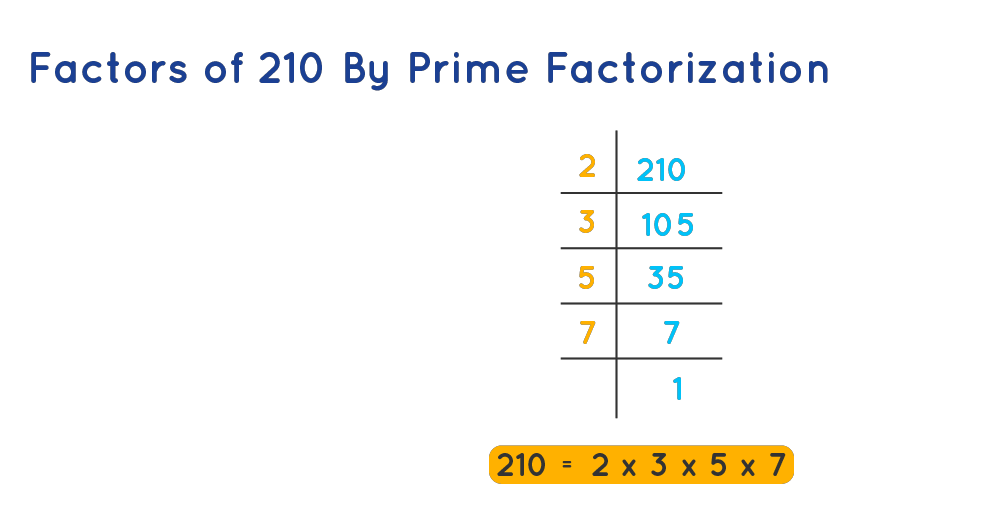

# Prime factorization
**Простая факторизация** - это разложение числа на простые множители
Простая факторизация числа 72 равна 2 × 2 × 2 × 3 × 3. Здесь 2 и 3 являются
простыми факторами числа 72.
Методы прайм-факторизации - как выполнить прайм-факторизацию
Существуют различные способы определения простых факторов числа. Два
распространенных метода: *Метод деления* и *Метод дерева факторов*
  
    
## Prime Factorization by Division Method
В этом методе число последовательно делится на простые числа до тех пор, пока
коэффициент не станет равным 1, причем при каждом делении определяется
простой множитель.
Для определения простых коэффициентов числа методом деления выполните
следующие действия:
**Шаг 1:** Делите число на наименьшее простое число (т.е. на 2) до тех пор, пока не получится разделить данное число без остатка.  
**Шаг 2:** Переходим к следующему простому числу и повторяем деление до тех пор,
пока коэффициент не станет равным 1.  
**Шаг 3:** Простые числа - это делители, используемые в процессе деления.    
*Пример 2:* Найти прайм-факторизацию числа 210 методом деления.   

*Решение:*  
Прайм-факторизация числа 210 методом деления может быть дана следующим
образом:

  
## Applications of Prime Factorization
В реальном мире факторизация простых чисел применяется довольно часто. К
числу наиболее значимых применений простой факторизации относятся:  
**Упрощение дробей:** Простая факторизация используется для упрощения
дробей путем аннулирования общих множителей в числителе и знаменателе. Этот
процесс позволяет свести дроби к их простейшей форме.  
**Наибольший общий делитель (GCD):** и наименьшее общее кратное (LCM):
Прайм-факторизация используется для нахождения GCD и LCM двух или более
чисел. Найдя общие простые множители и их соответствующие силы, мы можем
эффективно определить GCD и LCM.  
**Тесты на делимость:** Простая факторизация помогает определить делимость
числа на другое число. Например, если при простой факторизации число не
содержит определенного простого множителя, то оно не делится на другое число
с этим простым множителем.  
**Поиск простых чисел:** Простая факторизация может быть использована для
определения простых чисел. Если простая факторизация числа состоит только из
одного простого множителя (самого себя), то это число является простым.
Криптография: Прайм-факторизация играет важную роль в криптографии.


## GCD
>Закон Евклида о НОД  
GCD(a,b) = GCD(a-b,b) , если a>b.  
  
Реализация на C++ с использованием *Рекурсии*:
```c++
int gcd(int a, int b)
{
// Everything divides 0
if (a == 0) return b;
if (b == 0) return a;
// base case
if (a == b) return a;
// a is greater
if (a > b) return gcd(a - b, b);
return gcd(a, b - a);
}
```
## Рекурсия и Итерации
Рекурсия - это процесс, в котором функция вызывает саму себя напрямую или
косвенно. Функция, выполняющая рекурсию, называется рекурсивной функцией.
С помощью рекурсивных алгоритмов можно легко решать определенные задачи.
Примерами таких задач являются "Башни Ханоя", обходы дерева в порядке
"Inorder/Preorder/Postorder", обход графа в глубину и др. Рекурсивная функция
решает задачу, вызывая копию самой себя и решая более мелкие подзадачи
исходной задачи. Множество рекурсивных вызовов может быть сгенерировано по
мере необходимости. Важно знать, что для завершения этого процесса рекурсии
необходимо предоставить базовый случай, который останавливает рекурсию.  
**Преимущества рекурсии:**  
- Уменьшает длину кода и упрощает его чтение и написание.
- Применяется для задач, которые могут быть сформулированы с использованием
подзадач.  

**Свойства рекурсии:**
- Выполнение одних и тех же операций с разными входными данными.
- В каждом шаге используются более маленькие входные данные, чтобы
уменьшить размер задачи.
- Необходимо определить базовый случай для остановки рекурсии.

**Алгоритм рекурсии:**  
**1. Определите базовый случай:** определите самый простой случай, для которого
известно или тривиально решение. Это условие остановки для рекурсии.  
**2. Определите рекурсивный случай:** определите задачу в терминах более мелких
подзадач. Разбейте задачу на более мелкие версии самой себя и вызывайте
функцию рекурсивно для каждой из них.  
**3. Убедитесь, что рекурсия завершается:** убедитесь, что рекурсивная функция в
конечном итоге достигает базового случая и не входит в бесконечный цикл.  
**4. Объедините решения:** объедините решения для подзадач, чтобы решить
исходную задачу.

Рекурсия использует больше памяти, так как каждый рекурсивный вызов
добавляет в стек новый фрейм и хранит значения там до завершения вызова.
Базовый случай - это условие, которое останавливает рекурсию, иначе может
возникнуть переполнение стека.   
Рекурсия представляет собой процесс, при котором решение для базового случая
предоставляется, а решение для более крупной проблемы выражается через
более мелкие проблемы. Примеры рекурсивных алгоритмов: вычисление
факториала, обход дерева, сортировка.
В рекурсии код более короткий, но более сложный для понимания, и необходимо
аккуратно контролировать рекурсивные вызовы, чтобы избежать переполнения
стека.  
Рекурсия итерации: рекурсия завершается, когда базовое условие становится true,
в то время как итерация завершается, когда условие становится false. Рекурсия
использует больше памяти и имеет больший временной накладный расход из-за
накладных расходов на вызовы и возвраты функций. Однако
рекурсия может быть предпочтительным методом для решения определенных
задач, таких как обход деревьев и графов.  
Примеры практических задач, которые можно решить с помощью рекурсии,
включают вычисление чисел Фибоначчи и факториала, сортировку алгоритмами
типа быстрой сортировки, а также решение задачи башни Ханоя. Рекурсия
используется для обхода деревьев и графов, создания фракталов, реализации
алгоритмов метода "перебора вглубь" (backtracking) и меморизации (caching).  

**Сравнительная таблица рекурсии и итерации:**
| Номер |                                 Рекурсия                                |                     Итерация                     |
|-------|:-----------------------------------------------------------------------:|:------------------------------------------------:|
|   1   | Завершается, когда базовый случай становится истинным                   | Завершается, когда условие становится ложным.    |
|   2   | Используется с функциями                                                | Используется с циклами                           |
|   3   | Каждый рекурсивный вызов требует дополнительное место в стековой памяти | Каждая итерация не требует дополнительного места |
|   4   | Меньший размер кода                                                     | Больший размер кода                              |

  
  
**Проблема 1:** Напишите программу и рекуррентное соотношение для нахождения ряда Фибоначчи для n, где n > 2.  
*Математическое уравнение:*  
n, если n == 0, n == 1; fib(n) = fib(n-1) + fib(n-2) в противном случае;  
*Рекуррентное соотношение:*  
T(n) = T(n-1) + T(n-2) + O(1)  
*Рекурсивная программа:*  
Input:
```
 5
```
Output:
```
Fibonacci series of 5 numbers is : 0 1 1 2 3
```

*Реализация:*

```c++
#include <bits/stdc++.h>
using namespace std;
//Фибоначи функция
int fib(int n)
{
// условие остановки
if (n == 0) return 0;
// условие остановки
if (n == 1 || n == 2) return 1;
// условие рекурсии
else
return (fib(n - 1) + fib(n - 2));
}
int main()
{
int n = 5;
cout<< "Fibonacci series of 5 numbers is: ";
for (int i = 0; i < n; i++)
{
cout<<fib(i)<<" ";
}
return 0;
}
```
*Сложность по времени:* O(2^n)  
*Вспомогательное пространство:* O(n)  
Здесь представлено рекурсивное дерево для входного значения 5, которое наглядно показывает, как большую проблему можно решить на меньшие.  
**fib(n)** - это функция Фибоначчи. Сложность по времени данной программы может зависеть от вызова функции.  
fib(n) -> уровень CBT (Complete Binary Tree) -> 2^n-1 узлов -> 2^n вызовов функции -> 2^n*O(1) -> T(n) = O(2^n)  
В лучшем случае: T(n) = θ(2^n\2)  


**Рекурсивная программа:**
```c++
#include <bits/stdc++.h>
using namespace std;
// факториал
int f(int n)
{
// условие остановки
if (n == 0 || n == 1) return 1;
// основное рекурсивное условие
else return n * f(n - 1);
}
int main()
{
int n = 5;
cout  << "factorial of " << n << " is: " << f(n);
return 0;
}
```
Output
```
factorial of 5 is: 120
```

*Сложность по времени:* O(n)  
*Вспомогательное пространство:* O(n)  

> Работа по принципу


## Краткие выводы о рекурсии
В рекурсии существует два типа случаев: рекурсивный случай и базовый случай.
Базовый случай использует для завершения рекурсивной функции, случай когда


основное условие оказывается истинным.  
При каждом рекурсивном вызове в стековой памяти создается новая копия
данного метода.  
Бесконечная рекурсия может привести к исчерпанию стековой памяти.
Примеры рекурсивных алгоритмов: Merge Sort, Quick Sort, Tower of Hanoi, Fibonacci
Series, Factorial Problem и др.


## Решето Эратосфена и нахождение простых чисел
Для нахождения всех простых чисел не больше заданного числа n, следуя методу Эратосфена, нужно выполнить следующие шаги:

1 Выписать подряд все целые числа от двух до n (2, 3, 4, …, n).
2 Пусть переменная p изначально равна двум — первому простому числу.
3 Зачеркнуть в списке числа от 2p до n, считая шагами по p (это будут числа, кратные p: 2p, 3p, 4p, …).
4 Найти первое незачёркнутое число в списке, большее чем p, и присвоить значению переменной p это число.
5 Повторять шаги 3 и 4, пока возможно.
6 Теперь все незачёркнутые числа в списке — это все простые числа от 2 до n.

На практике, алгоритм можно улучшить следующим образом. На шаге № 3 числа можно зачеркивать, начиная сразу с числа p2, потому что все меньшие числа, кратные p, обязательно имеют простой делитель меньше p, а они уже зачеркнуты к этому времени. И, соответственно, останавливать алгоритм можно, когда p2 станет больше, чем n. Кроме того, все простые числа, кроме 2, — нечётные числа, и поэтому для них можно считать шагами по 2p, начиная с p2.


```c+
#include <bits/stdc++.h> 
using namespace std; 
  
void SieveOfEratosthenes(int n) 
{ 
    // Create a boolean array "prime[0..n]" and initialize 
    // all entries it as true. A value in prime[i] will 
    // finally be false if i is Not a prime, else true. 
    bool prime[n + 1]; 
    memset(prime, true, sizeof(prime)); 
  
    for (int p = 2; p * p <= n; p++) { 
        // If prime[p] is not changed, then it is a prime 
        if (prime[p] == true) { 
            // Update all multiples of p greater than or 
            // equal to the square of it numbers which are 
            // multiple of p and are less than p^2 are 
            // already been marked. 
            for (int i = p * p; i <= n; i += p) 
                prime[i] = false; 
        } 
    } 
  
    // Print all prime numbers 
    for (int p = 2; p <= n; p++) 
        if (prime[p]) 
            cout << p << " "; 
} 
  
// Driver Code 
int main() 
{ 
    int n = 30; 
    cout << "Following are the prime numbers smaller "
         << " than or equal to " << n << endl; 
    SieveOfEratosthenes(n); 
    return 0; 
}
```
