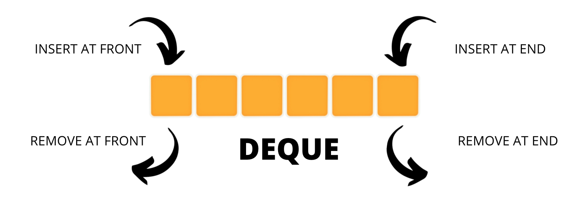
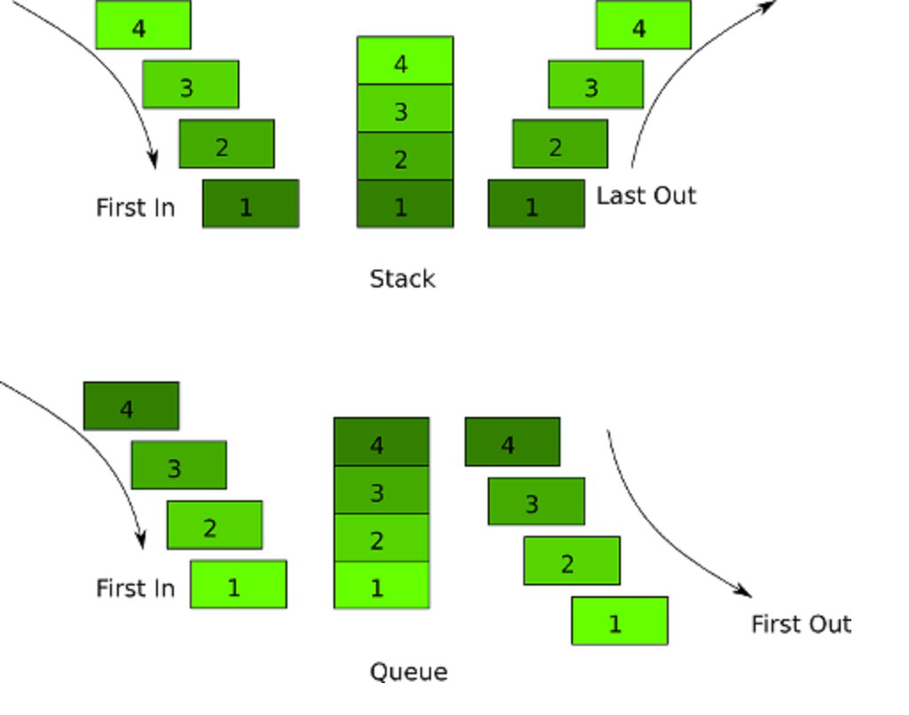

# Контейнеры STL

## Stack


**Создание:**
```c++
#include <stack>
std::stack<int> myStack;
```

**Использование:**
```c++
myStack.push(1); // Добавление элемента в стек
myStack.push(2);
int topElement = myStack.top(); // Получение верхнего элемента (без удаления)
myStack.pop(); // Удаление верхнего элемента
bool isEmpty = myStack.empty(); // Проверка на пустоту
int stackSize = myStack.size(); // Получение размера стека
```
**Плюсы:**
- Очень быстрый доступ к верхнему элементу (O(1)).
- Прост в использовании.

**Минусы:**
- Ограничен фиксированным размером.
- Нет доступа к произвольным элементам (нельзя получить доступ к элементу по
индексу).

## Queue 


**Создание:**
```c++
#include <queue>
std::queue<int> myQueue;
```
**Использование:**
```c++
myQueue.push(1); // Добавление элемента в конец очереди
myQueue.push(2);
int frontElement = myQueue.front(); // Получение первого элемента (без удаления)
myQueue.pop(); // Удаление первого элемента
bool isEmpty = myQueue.empty(); // Проверка на пустоту
int queueSize = myQueue.size(); // Получение размера очереди
```
**Плюсы:**
- Очень быстрый доступ к первому элементу (O(1)).
- Прост в использовании.

**Минусы:**
- Ограничен фиксированным размером.
- Нет доступа к произвольным элементам (нельзя получить доступ к элементу по
индексу).

## Deque


**Создание:**
```c++
#include <deque>
std::deque<int> myDeque;
```

**Использование:**
```c++
myDeque.push_back(1); // Добавление элемента в конец дека
myDeque.push_front(2); // Добавление элемента в начало дека
int backElement = myDeque.back(); // Получение последнего элемента (без
удаления)
int frontElement = myDeque.front(); // Получение первого элемента (без удаления)
myDeque.pop_back(); // Удаление последнего элемента
myDeque.pop_front(); // Удаление первого элемента
bool isEmpty = myDeque.empty(); // Проверка на пустоту
int dequeSize = myDeque.size(); // Получение размера дека
а
```
**Плюсы:**
- Быстрый доступ к началу и концу (O(1)).
- Динамический размер.

**Минусы:**
- Немного более сложен в использовании, чем стек или очередь.



## Map


**Создание:**
```c++
#include <map>
std::map<std::string, int> myMap;
```

**Использование:**
```c++
myMap["key1"] = 1; // Добавление элемента в карту
myMap["key2"] = 2;
int value = myMap["key1"]; // Получение значения по ключу
myMap.erase("key2"); // Удаление элемента по ключу
bool containsKey = myMap.count("key1") > 0; // Проверка наличия ключа
int mapSize = myMap.size(); // Получение размера карты
```
**Плюсы:**
- Очень быстрый доступ к значениям по ключу (O(log n)).
- Может содержать уникальные ключи.

**Минусы:**
- Сложнее в использовании, чем вектор или список.
- Медленнее, чем хэш-таблица для поиска (если нужен быстрый поиск).
## Vector


**Создание:**
```c++
#include <vector>
std::vector<int> myVector;
```
**Использование:**
```c++
myVector.push_back(1); // Добавление элемента в конец вектора
myVector.push_back(2);
int element = myVector[0]; // Получение элемента по индексу
myVector.pop_back(); // Удаление последнего элемента
bool isEmpty = myVector.empty(); // Проверка на пустоту
int vectorSize = myVector.size(); // Получение размера вектора
```
**Плюсы:**
- Быстрый доступ к элементам по индексу (O(1)).
- Динамический размер.

**Минусы:**
- Медленный доступ к элементам вставки/удаления в начале или в середине (O(n)).
- Нет встроенной проверки на выход за границы (безопасности) при доступе по
индексу.

### **Итоговая таблица сложностей методов в контейнерах:**


