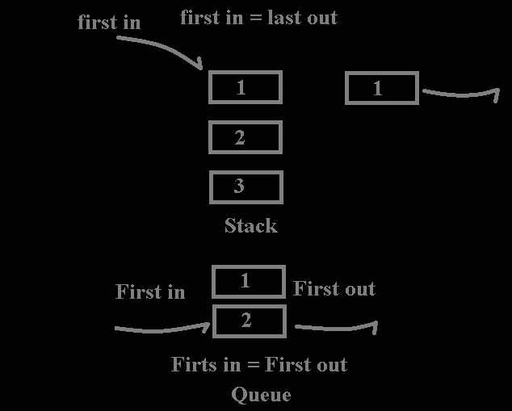

# Контейнеры STL

## Stack


**Создание:**
```c++
#include <stack>
std::stack<int> myStack;
```

**Использование:**
```c++
myStack.push(1); // Добавление элемента в стек
myStack.push(2);
int topElement = myStack.top(); // Получение верхнего элемента (без удаления)
myStack.pop(); // Удаление верхнего элемента
bool isEmpty = myStack.empty(); // Проверка на пустоту
int stackSize = myStack.size(); // Получение размера стека
```
```c++
#include <iostream>
#include <stack>

int main() {
    // Создаем стек целых чисел
    std::stack<int> myStack;

    // Добавляем элементы в стек
    myStack.push(1);
    myStack.push(2);
    myStack.push(3);
    myStack.push(4);

    // Выводим элементы стека
    std::cout << "Stack elements:\n";
    while (!myStack.empty()) {
        std::cout << myStack.top() << " ";
        myStack.pop();
    }
    std::cout << "\n";

    return 0;
}

```

**Плюсы:**
- Очень быстрый доступ к верхнему элементу (O(1)).
- Прост в использовании.

**Минусы:**
- Ограничен фиксированным размером.
- Нет доступа к произвольным элементам (нельзя получить доступ к элементу по
индексу).

## Queue 


**Создание:**
```c++
#include <queue>
std::queue<int> myQueue;
```
**Использование:**
```c++
myQueue.push(1); // Добавление элемента в конец очереди
myQueue.push(2);
int frontElement = myQueue.front(); // Получение первого элемента (без удаления)
myQueue.pop(); // Удаление первого элемента
bool isEmpty = myQueue.empty(); // Проверка на пустоту
int queueSize = myQueue.size(); // Получение размера очереди
```
**Плюсы:**
- Очень быстрый доступ к первому элементу (O(1)).
- Прост в использовании.

**Минусы:**
- Ограничен фиксированным размером.
- Нет доступа к произвольным элементам (нельзя получить доступ к элементу по
индексу).

## Deque


**Создание:**
```c++
#include <deque>
std::deque<int> myDeque;
```

**Использование:**
```c++
myDeque.push_back(1); // Добавление элемента в конец дека
myDeque.push_front(2); // Добавление элемента в начало дека
int backElement = myDeque.back(); // Получение последнего элемента (без
удаления)
int frontElement = myDeque.front(); // Получение первого элемента (без удаления)
myDeque.pop_back(); // Удаление последнего элемента
myDeque.pop_front(); // Удаление первого элемента
bool isEmpty = myDeque.empty(); // Проверка на пустоту
int dequeSize = myDeque.size(); // Получение размера дека
а
```
**Плюсы:**
- Быстрый доступ к началу и концу (O(1)).
- Динамический размер.

**Минусы:**
- Немного более сложен в использовании, чем стек или очередь.



## Map


**Создание:**
```c++
#include <map>
std::map<std::string, int> myMap;
```

**Использование:**
```c++
myMap["key1"] = 1; // Добавление элемента в карту
myMap["key2"] = 2;
int value = myMap["key1"]; // Получение значения по ключу
myMap.erase("key2"); // Удаление элемента по ключу
bool containsKey = myMap.count("key1") > 0; // Проверка наличия ключа
int mapSize = myMap.size(); // Получение размера карты
```
**Плюсы:**
- Очень быстрый доступ к значениям по ключу (O(log n)).
- Может содержать уникальные ключи.

**Минусы:**
- Сложнее в использовании, чем вектор или список.
- Медленнее, чем хэш-таблица для поиска (если нужен быстрый поиск).

## Unordered map
```c++
#include <iostream>
#include <unordered_map>
#include <string>

int main() {
    // Создаем unordered_map с ключами типа int и значениями типа std::string
    std::unordered_map<int, std::string> myMap;

    // Вставляем пары ключ-значение
    myMap[1] = "One";
    myMap[2] = "Two";
    myMap[3] = "Three";
    myMap[4] = "Four";

    // Выводим элементы unordered_map
    for (const auto& pair : myMap) {
        std::cout << "Key: " << pair.first << ", Value: " << pair.second << std::endl;
    }

    // Проверяем наличие элемента по ключу
    int keyToFind = 2;
    if (myMap.find(keyToFind) != myMap.end()) {
        std::cout << "Element with key " << keyToFind << " found: " << myMap[keyToFind] << std::endl;
    } else {
        std::cout << "Element with key " << keyToFind << " not found." << std::endl;
    }

    // Удаляем элемент по ключу
    int keyToRemove = 3;
    myMap.erase(keyToRemove);

    // Выводим обновленный unordered_map
    std::cout << "\nAfter removing element with key " << keyToRemove << ":\n";
    for (const auto& pair : myMap) {
        std::cout << "Key: " << pair.first << ", Value: " << pair.second << std::endl;
    }
}

```
**Плюсы**
- Быстрый поиск - Поиск элемента в std::unordered_map происходит за O(1) в среднем случае, что делает его эффективным для операций поиска.
- Гибкость ключей - Можно использовать пользовательские типы данных в качестве ключей, если определены соответствующие операции хэширования и сравнения.
- Оптимальность вставки и удаления - Вставка и удаление элементов также могут быть эффективными, особенно при большом объеме данных.
- Отсутствие упорядочивания - В отличие от std::map, std::unordered_map не упорядочивает элементы по ключу, что может быть выгодно в некоторых случаях.
**Минусы**
- Потребление памяти - std::unordered_map может потреблять больше памяти по сравнению с std::map, так как требуется хранение хэш-таблицы и дополнительных данных для обеспечения быстрого доступа.
- Неустойчивость итераторов - Итераторы на элементы std::unordered_map могут быть неустойчивы при изменении контейнера. Вставка новых элементов может привести к перехешированию и перемещению элементов в другие ячейки хэш-таблицы.
- Производительность в крайних случаях - В худшем случае, при коллизиях (когда несколько ключей хэшируются в одну и ту же ячейку), производительность std::unordered_map может упасть до O(n), где n - количество элементов.

## Vector


**Создание:**
```c++
#include <vector>
std::vector<int> myVector;
```
**Использование:**
**ВНИМАНИЕ ЗАДАВАЙТЕ РАЗМЕР ВЕКТОРА ЕСЛИ ЭТО ВОЗМОЖНО К ПРИМЕРУ vector<int> v(size)**
```c++
myVector.push_back(1); // Добавление элемента в конец вектора
myVector.push_back(2);
int element = myVector[0]; // Получение элемента по индексу
myVector.pop_back(); // Удаление последнего элемента
bool isEmpty = myVector.empty(); // Проверка на пустоту
int vectorSize = myVector.size(); // Получение размера вектора
```
```c++
#include <iostream>
#include <vector>

int main() {
    // Создаем вектор целых чисел
    std::vector<int> myVector;

    // Добавляем элементы в вектор
    myVector.push_back(1);
    myVector.push_back(2);
    myVector.push_back(3);
    myVector.push_back(4);

    // Выводим элементы вектора
    std::cout << "Vector elements:\n";
    for (const auto& element : myVector) {
        std::cout << element << " ";
    }
    std::cout << "\n";

    // Изменяем значение элемента по индексу
    myVector[2] = 33;

    // Выводим обновленные элементы вектора
    std::cout << "Updated vector elements:\n";
    for (const auto& element : myVector) {
        std::cout << element << " ";
    }
    std::cout << "\n";

    // Удаляем последний элемент из вектора
    myVector.pop_back();

    // Выводим элементы после удаления
    std::cout << "Vector elements after pop_back:\n";
    for (const auto& element : myVector) {
        std::cout << element << " ";
    }
    std::cout << "\n";

    // Получаем размер вектора
    std::cout << "Vector size: " << myVector.size() << "\n";

    // Проверяем, пуст ли вектор
    std::cout << "Vector is " << (myVector.empty() ? "empty" : "not empty") << "\n";

    return 0;
}

```

**Плюсы:**
- Быстрый доступ к элементам по индексу (O(1)).
- Динамический размер.

**Минусы:**
- Медленный доступ к элементам вставки/удаления в начале или в середине (O(n)).
- Нет встроенной проверки на выход за границы (безопасности) при доступе по
индексу.

### **Итоговая таблица сложностей методов в контейнерах:**


