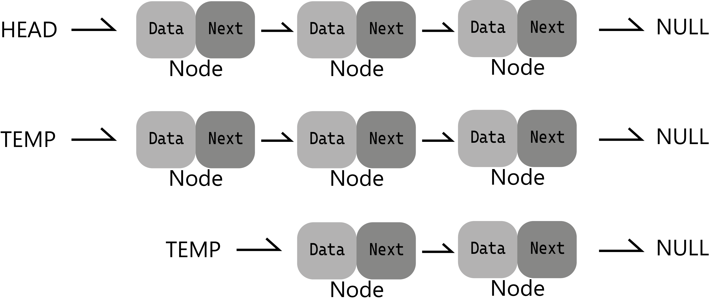
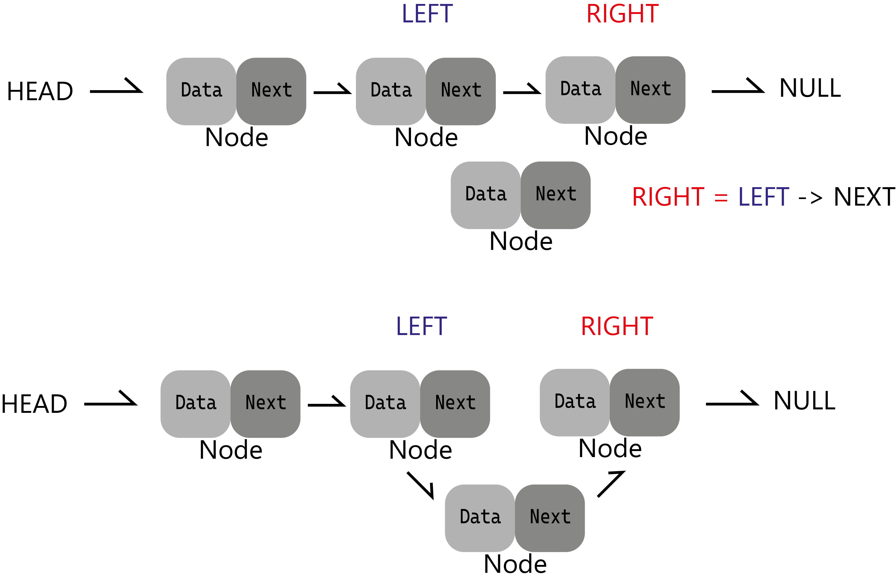
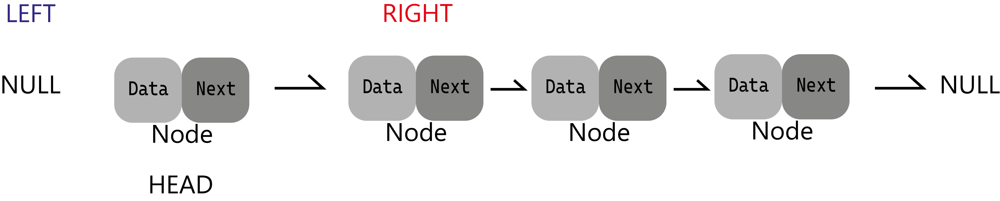
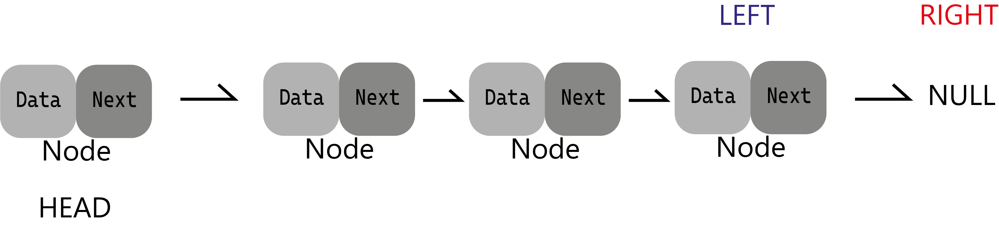
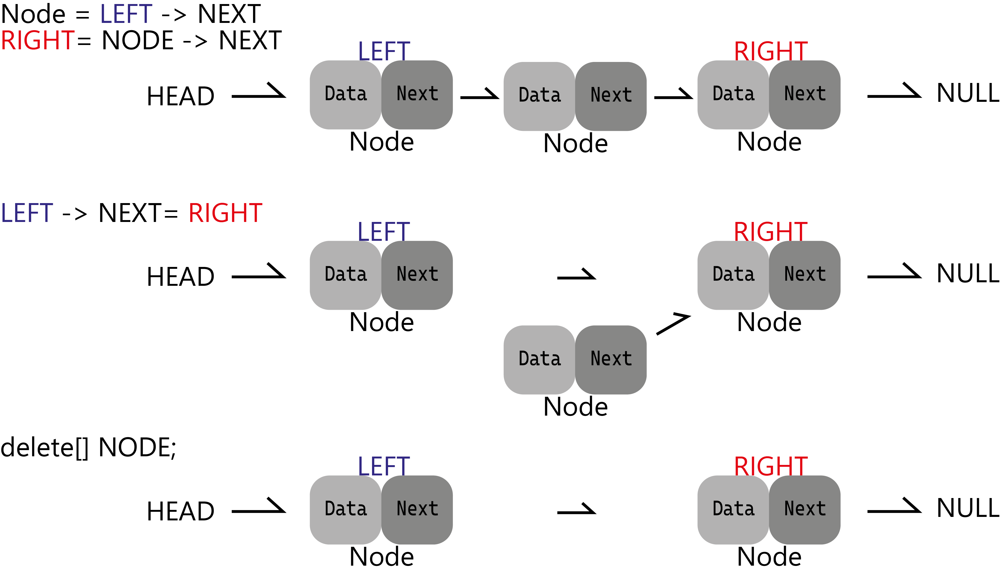
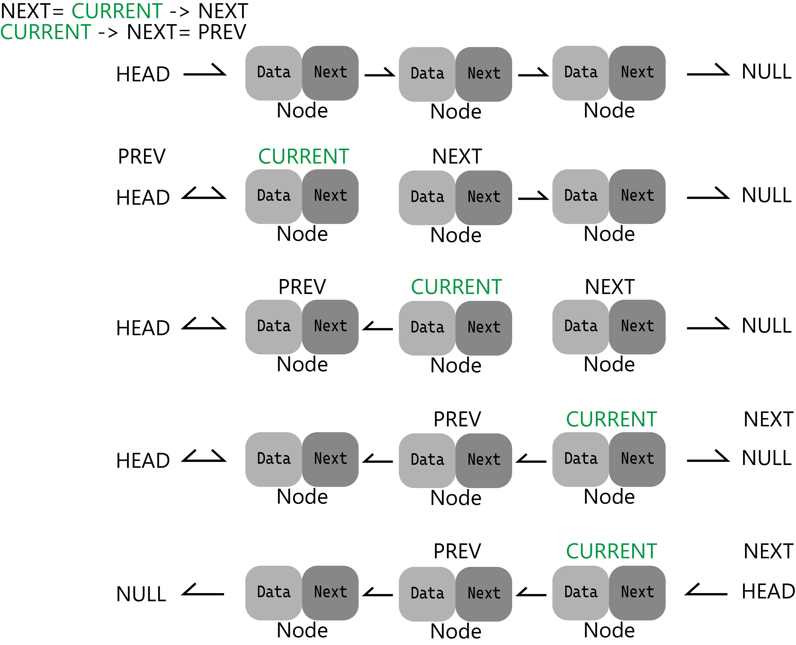

# Linked List

Это структура которая состоит из **Нодов (Nodes)** которые связанны между собой и каждый нод указывает на следующую через указатель *next* и если этот
нод последний то у него этот указатель будет указывать на пустоту  
## Операции связанного списка:
Вставка элемента  
Удаление элемента  
Реверс листа  
Отображение листа

### Отображение листа  
Для этого создаем копию листа начиная с головы и с помощью цикла проходим
по всем элементам в копии при этом происходит это с помощью изменения
головы копии на следующий и выводом головы копии
```c++
while(TEMP != NULL) // Node* TEMP = HEAD
{
    cout << TEMP -> Data
    TEMP = TEMP -> Next
}
```


### Вставка элемента  


Чтобы вставить ноду в лист то нужно во первых если этой ноды не существует то
создать ее иначе указать на нее и после найти позицию куда вставить ноду.  
Чтобы найти место гуда нужно вставить ноду то есть индекс к примеру он будет **k** и у ноды этого индекса будет левый и правый элемент , левый – элемент с
текущем (без вставки ноды) индексом **k-1** и правый с индексом **k** 
После вставки ноды у левой индекс будет таким же k-1 у вставленной ноды **k** и у
правого уже **k+1**  
После того как нашли все индексы ноды то начинаем сам процесс вставки  
С начала левой нодой указываем на ноду которую нужно вставить, после с ноды
которую нужно вставить нужно указать на правую ноду 
```
Left->next = node;  
node->next = Right; 
``` 
Но бывают случаи когда нужно вставитт в начало или в конец то нужно добавить
дополнительные условия.

## Вставка в начало

Указываем **Next** у ноды на голову после чего делаем ее головой.  
Дополнительное условие:
```c++
if(left == nullptr){
node->next = head;
head = node;
return head;
}
```

### Вставка в конец

Указываем у левой ноды указатель на ноду (уже сделанно) и делаем ноду концом.
Дополнительное условие:
```c++
if(right == nullptr)
{
tail = node;
}
```

## Удаление элемента

Для удаления **k** того элемента нужно найти ноду на этом индексе перед и после
нее. Для этого достаточно найти ноду что перед остальные получить через
указатель. Далее указать next у ноды что перед той которую нужно удалить на ту что нужно удалить и у той что нужно удалить указать **next** на ту ноду которая после ноды что нужно удалить. После того как отсоединили ноду из листа нужно отчистить ее из памяти удалив ее.

## Реверс листа

**Реализация на cpp:**
```c++
#include <string>
#include <iostream>
using namespace std;

class Node {
    public:
        int key;
        Node* next;

    public:
        Node(int key) {
            this->key = key;
            this->next = nullptr;
        }
};

class LinkedList {
    public:
        Node* head;
        Node* tail;

    public:
        LinkedList() {
            this->head = nullptr;
            this->tail = nullptr;
        }

        ~LinkedList() {
            while (head != nullptr) pop_front();
        }

        void pop_front() {
            if (head == nullptr) {
                return;
            }
            if (head == tail) {
                delete tail;
                head = tail = nullptr;
                return;
            }
            Node* node = head;
            head = node->next;
            delete node;
        }

        void pop_back() {
            if (head == nullptr) {
                return;
            }
            if (head == tail) {
                delete tail;
                this->head = nullptr;
                this->tail = nullptr;
                return;
            }
            Node* node = head;
            for (; node->next != tail; node = node->next);
            node->next = nullptr;
            delete tail;
            tail = node;
        }

        void push_back(int val) {
            Node* node = new Node(val);
            if (head == nullptr) {
                head = node;
            }
            if (tail != nullptr) {
                tail->next = node;
            }
            tail = node;
        }

        void push_front(int val) {
            Node* node = new Node(val);
            node->next = head;
            head = node;
            if (tail == nullptr) {
                tail = node;
            }
        }

        Node* getAt(int k) {
            if (k < 0) {
                return nullptr;
            }
            int n = 0;
            Node* node = head;
            while (node && n != k && node->next) {
                node = node->next;
                n++;
            }
            return (n == k) ? node : nullptr;
        }

        void insert(int k, int val) {
            Node* node = new Node(val);
            Node* left = getAt(k);
            if (left == nullptr) {
                node->next = head;
                head = node;
                return head;
            }
            Node* right = left->next;
            left->next = node;
            node->next = right;
            if (right == nullptr) {
                tail = node;
            }
        }

        Node* reverse() {
            Node* current = head;
            Node* prev = nullptr;
            Node* next = nullptr;
            while (current) {
                next = current->next;
                current->next = prev;
                prev = current;
                current = next;
            }
            head = prev;
            return head;
        }

        void erase(int k) {
            if (k < 0) return;
            if (k == 0) {
                pop_front();
                return;
            }
            Node* left = getAt(k - 1);
            Node* node = left->next;
            if (node == nullptr) return;
            Node* right = node->next;
            left->next = right;
            if (node == tail) {
                tail = left;
            }
            delete node;
        }

        void print() {
            Node* temp = head;
            while (temp != NULL) {
                cout << temp->key << " ";
                temp = temp->next;
            }
            cout << endl;
        }
};
```
## Нахождение цикла 
Цикл в linked list означает что будет цикл те на какую либо ноду в нем будет указывать (next) больше чем 1 раз кроме случая когда конец указывает в начало
Для нахождения цикла в linked list можно сделать следующее - в ноду добавить переменную cnt = 0 которая будет показывать сколько раз на нее указывали , проходить по всему листу и для каждой ноды увеличивать cnt и если он будет больше 1 то значит есть цикл и это продолжаем до тех пор пока не закончится лист или не обнаружется цикл.
```
#include <iostream>
using namespace std;

class Node{
public:
    int val;
    Node* next;
    int cnt;
public:
    Node(int val){
        this->val = val;
        this->next = nullptr;
    }
};
class LL{
public:
    Node* root;
    Node* tail;
public:
    LL(){
        root = nullptr;
        tail = nullptr;
    }
    void insert(int val){
        Node* newNode = new Node(val);
        if (!root) {
            root = newNode;
            tail = root;
            return;
        }
        Node* current = root;
        while (current->next) {
            current = current->next;
        }
        current->next = newNode;
        tail = newNode;
    }
    bool detectLoop(){
        if (!root) {
            return false;
        }
        Node* node = root;
        while(node){
            node->cnt++;   
            if(node->cnt>1){  // если текущаяя нода вернулась в прошлую то ее cnt увеличивается на 1 и будет равен 2 
                return true;
            }   
            node = node->next;      
        }
        return false;   
    }
};
int main() {
    LL ll;
    ll.insert(10);
    ll.insert(5);
    ll.insert(15);
    ll.insert(3);
    ll.insert(7);
    ll.insert(12);
    ll.insert(18);
    ll.tail->next = ll.root->next;
    cout<<ll.detectLoop();
    return 0;
}
```
## Применение связанных списков:
1. Хранение и управление последовательными данными. Связанные списки
позволяют эффективно добавлять и удалять элементы из середины списка.
2. Имплементация структур данных, таких как стеки и очереди.
3. Реализация других структур данных, таких как хеш-таблицы и графы.
Плюсы связанных списков:
1. Гибкость: Связанные списки позволяют эффективно добавлять и удалять
элементы из середины списка без необходимости перемещения остальных
элементов.
2. Динамическое выделение памяти: Память для узлов связанного списка
выделяется динамически, что позволяет создавать списки переменной длины.
Минусы связанных списков:
1. Дополнительная память: Каждый элемент связанного списка требует
дополнительной памяти для хранения указателя на следующий элемент.
2. Доступ по индексу: Для доступа к элементу по индексу нужно пройти весь
список с начала, что может быть неэффективно в случае больших списков.
3. Не подходят для случайного доступа: Если требуется быстрый случайный доступ
к элементам, связанные списки могут быть неэффективными. В таких случаях
массивы могут быть более подходящим выбором.
Связанные списки - это мощная структура данных с определенными
преимуществами и недостатками, и их выбор зависит от конкретной задачи и
требований.  


### [Double-Linked lists](https://www.geeksforgeeks.org/introduction-and-insertion-in-a-doubly-linked-list/)
