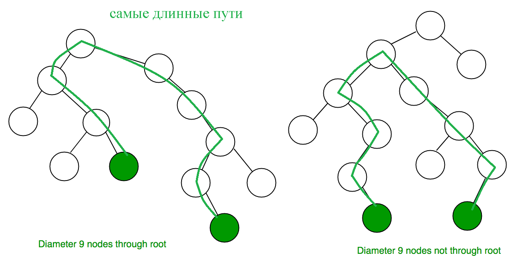

# Бинарное Дерево


## Binary Tree что это такое
Дерево у каждого разветвления максимум 2 ветви.  
Пусть основание разветвления (элемент) это родитель а элемент левой 
ветви левый ребенок и правой ветви правый ребенок.  
Правило составления гласит, что левый меньше или равен родителя по 
значению и родитель меньше правого по значению.  
### Как его создавать и делать вставку  
Есть несколько способов одним из которых является рекурсивый или 
итеративный метод на основе сравнении по общему правилу дерева.  
Если дерева не существует то и корня не существует тогда нужно 
создать новый элемент и указать что это корень.  
Если элементов в дереве больше 0 то начинаем основной метод.
Мы ищем место куда нужно вставить элемент начиная от корня с 
помощью
указателей двигаясь по ветвям пока не появиться пустое место(нода у которой нет детей), то есть если значение новой ноды больше 
родителя то двигаемся к следующему родителю на правую ветвь иначе,
если меньше или
равен на левую и так повторяем пока следующая не будет пустая тогда у 
последней ставим указатель на новую ноду.

**Рекурсивная реализация**
```c++
void insert(int val){
    root = insert(root,val);
}
Node* insert(Node* root, int val){
    if(!root){
        return new Node(val);
    }
    else{
        if(val > root->val){
            root->right = insert(root->right, val);
        }
        else{
            root->left = insert(root->left, val);
        }
    }
    return root;
}
```

**Итеративная реализация**
```c++
void insert(int val){
    root = insert(root,val);
}
Node* insert(Node* root, int val) {
    Node* newNode = new Node(val);
    if (!root) {
        return newNode;
    }
    Node* cur = root;
    while (cur) {
        if (val > cur->val) {
            if (!cur->right) {
                cur->right = newNode;
                return root; 
            }
            cur = cur->right;
        } else {
            if (!cur->left) {
                cur->left = newNode;
                return root; 
            }
            cur = cur->left;
            }
        }
    return root;
}
```


### Как вывести дерево
Чтобы выводить дерево нужно проходиться по всем элементам этого 
дерева и выводить каждый элемент.  
**Инфиксный обход (симметричный обход):** Обходит дерево в порядке увеличения значений узлов. 
Печатает значения узлов в отсортированном порядке, если дерево является бинарным поисковым 
деревом.  
Он идет по обоим ветвям и для них делает тоже самое рекурсивно пока нода не окажется пуста
Для этого просто сделаем функцию по элементу которая вызывает сама себя для левого и правой 
ветви и работает в случае если нода не пустая
и бывают разные реализации этого:

```c++
void inorderTraversal(Node* node) {
    if (node) {
        inorderTraversal(node->left);
        cout << node->val << " ";
        inorderTraversal(node->right);
    }
}
```

**Префиксный обход (прямой обход):** Начинает с корневого узла и постепенно двигается вниз по дереву, обходя корень, затем его левое и правое поддеревья.

```c++
void preorderTraversal(Node* node) {
    if (node) {
        cout << node->val << " ";
        preorderTraversal(node->left);
        preorderTraversal(node->right);
    }
}
```
**Постфиксный обход:** обходит левое и правое поддеревья после корень.
```c++
void postorderTraversal(Node* node) {
    if (node) {
        postorderTraversal(node->left);
        postorderTraversal(node->right);
        cout << node->val << " ";
    }
}
```
Вывод дерева в вертикальном виде используя **инфиксный обход**:
```c++
#include <iostream>
using namespace std;

void printTreeStructure(Node* node, int level = 0) {
    if (node) {
        printTreeStructure(node->right, level + 1);
        for (int i = 0; i < level; i++) {
            cout << " "; // Вставляем пробелы для отступа
        }
        cout << node->val << endl;
        printTreeStructure(node->left, level + 1);
    }
}
```
### Удаление элемента по значению
Для удаления определенного элемента из бинарного дерева, вам нужно выполнить следующие 
шаги:
1. Найти узел, который соответствует удаляемому элементу.
2. Если узел является листом *(у него нет детей)*, просто удалите этот узел.


3. Eсли у узла есть только один ребенок *(левый или правый)*, то удалите этот узел и замените его на 
своего единственного ребенка.

4. Если у узла есть два ребенка, вам нужно найти наименьший элемент в правом поддереве *(или
наибольший элемент в левом поддереве)*. Этот элемент заменит удаляемый узел. Затем 
рекурсивно удалите этот элемент из правого *(или левого)* поддерева.


```c++
// Функция для нахождения узла с минимальным значением в дереве.
Node* findMin(Node* node) {
    while (node->left) {
        node = node->left;
    }
    return node;
}

// Функция для удаления узла с заданным ключом из бинарного дерева поиска.
Node* deleteNode(Node* root, int key) {
    if (!root) {
        return root; // Если дерево пустое, возвращаем NULL.
    }

    // Если ключ меньше значения корня, производим удаление в левом поддереве.
    if (key < root->val) {
        root->left = deleteNode(root->left, key);
    }
    // Если ключ больше значения корня, производим удаление в правом поддереве.
    else if (key > root->val) {
        root->right = deleteNode(root->right, key);
    }
    // Если ключ равен значению корня, то это узел, который нужно удалить.
    else {
        // Узел с одним потомком или без потомков.
        if (!root->left) {
            Node* temp = root->right;
            delete root;
            return temp;
        }
        else if (!root->right) {
            Node* temp = root->left;
            delete root;
            return temp;
        }

        // Узел с двумя потомками.
        Node* temp = findMin(root->right); // Находим минимальный узел в правом поддереве (это будет преемник).
        root->val = temp->val; // Копируем значение преемника в узел.
        root->right = deleteNode(root->right, temp->val); // Удаляем преемника.
    }

    return root; // Возвращаем измененное дерево.
}
```
Вызывая `deleteNode(tree.root, key)` вы удалите узел с указанным значением `key` из вашего 
бинарного дерева.
```c++
#include <iostream>
using namespace std;

// Определение узла дерева
class Node {
public:
    int val;               // Значение узла
    Node *left, *right;    // Левый и правый потомки

    // Конструктор узла
    Node(int val) : val(val), left(nullptr), right(nullptr) {}
};

// Определение бинарного дерева поиска
class BinaryTree {
public:
    Node* root;            // Корневой узел дерева

    // Конструктор дерева
    BinaryTree() : root(nullptr) {}

    // Функция вставки значения в дерево
    void insert(int val) {
        Node* node = new Node(val);
        if (!root) {
            root = node;
        } else {
            Node* cur = root;
            while (true) {
                if (val <= cur->val) {
                    if (!cur->left) {
                        cur->left = node;
                        break;
                    }
                    cur = cur->left;
                } else {
                    if (!cur->right) {
                        cur->right = node;
                        break;
                    }
                    cur = cur->right;
                }
            }
        }
    }

    // Функция бинарного поиска в дереве
    Node* BinarySearch(Node* root, int x) {
        if (!root || root->val == x) {
            return root; // Если дерево пустое или корень является искомым значением
        }
        if (root->val < x) {
            return BinarySearch(root->right, x); // Поиск в правом поддереве
        } else {
            return BinarySearch(root->left, x);  // Поиск в левом поддереве
        }
    }
};

int main() {
    BinaryTree tree;
    tree.insert(50); tree.insert(30); tree.insert(20);
    tree.insert(40); tree.insert(70); tree.insert(60); tree.insert(80);

    int x = 6;
    if (tree.BinarySearch(tree.root, x) == nullptr)
        cout << x << " not found" << endl;
    else
        cout << x << " found" << endl;

    x = 60;
    if (tree.BinarySearch(tree.root, x) == nullptr)
        cout << x << " not found" << endl;
    else
        cout << x << " found" << endl;

    return 0;
}
```
Output
```
6 not found
60 found
```

Временная сложность: **O(h)**, где **h** - высота BST (*Binary Search Tree*).
Вспомогательное пространство: **O(h)v**, где **h** - высота BST. Это связано с тем, что максимальный
объем пространства, необходимый для хранения стека рекурсии, будет равен **h**.
### Диаметр бинарного дерева
*Диаметр бинарного дерева* - это наибольшее количество рёбер между двумя узлами дерева. Другими словами, это самый длинный путь от одного узла до другого.
  
**Алгоритм вычисления:**  
1. Рекурсивно вычислите глубину каждого узла.  
2. Для каждого узла, диаметр равен сумме глубин его двух поддеревьев (левое + правое).
3. Отслеживайте и обновляйте максимальное значение диаметра на протяжении всего обхода.



**Реализация**
```c++
struct TreeNode {
    int val;
    TreeNode* left;
    TreeNode* right;
    TreeNode(int x) : val(x), left(NULL), right(NULL) {}
};

class BinaryTree {
    int max_diameter = 0;

    int depth(TreeNode* node) {
        if (!node) return 0;

        int left_depth = depth(node->left);
        int right_depth = depth(node->right);

        // Обновляем максимальный диаметр
        max_diameter = max(max_diameter, left_depth + right_depth);

        return 1 + max(left_depth, right_depth);
    }

public:
    int diameter(TreeNode* root) {
        depth(root);
        return max_diameter;
    }
};
```
Данный алгоритм эффективно вычисляет диаметр бинарного дерева с временной сложностью **O(n)**, где **n** - количество узлов в дереве, так как каждый узел посещается ровно один раз.
