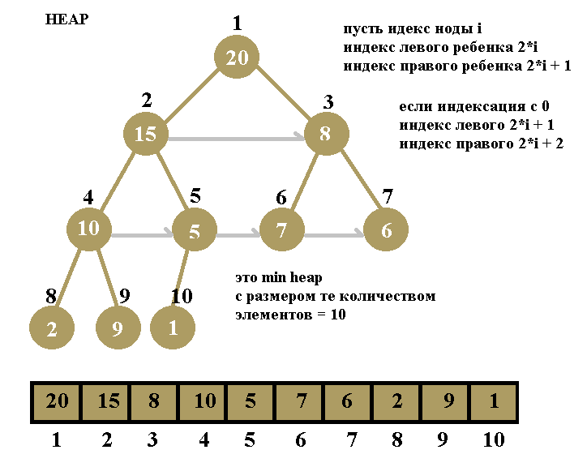
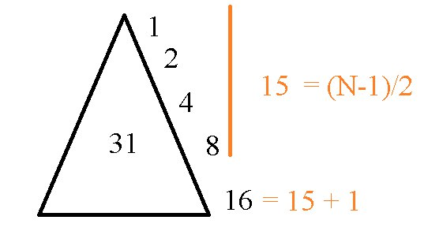
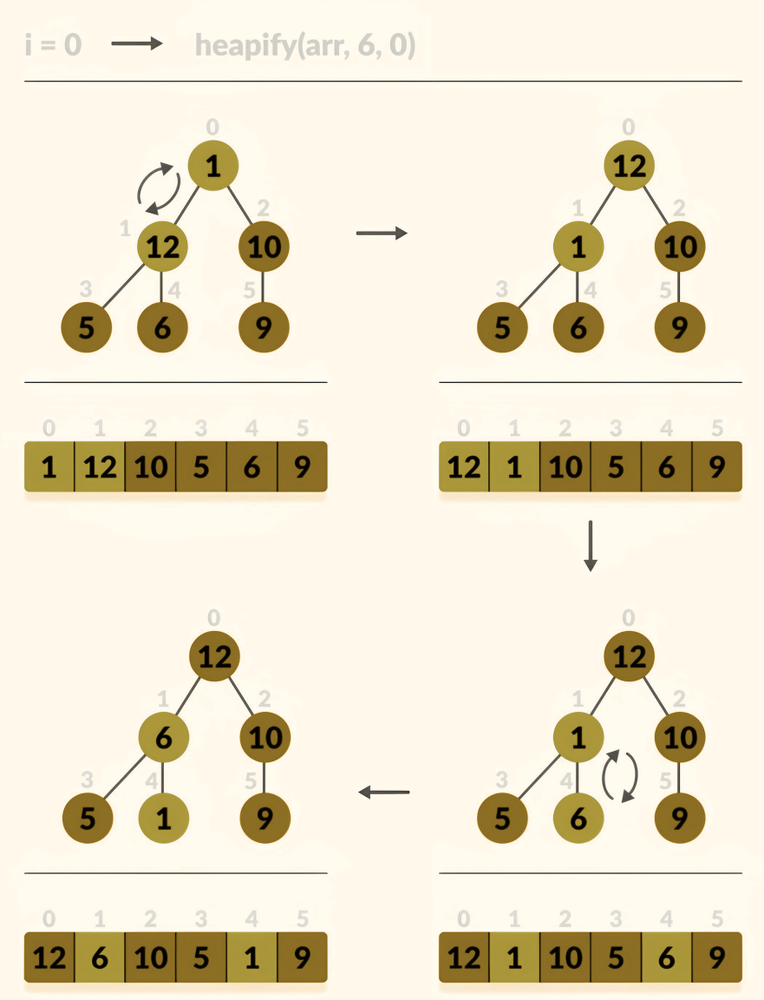
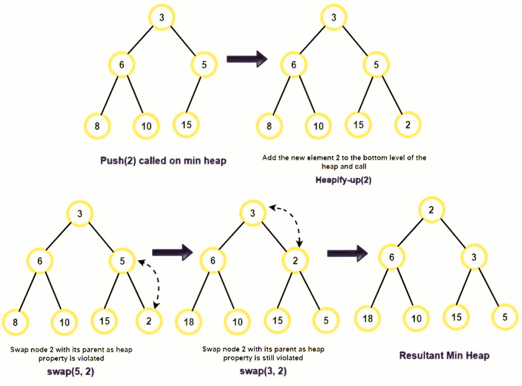

# Heap

## Max-куча
В этой куче значение корневого узла должно быть наибольшим среди всех его
дочерних узлов, то же самое должно быть сделано и для его левого и правого
поддерева.  
Общее количество сравнений, необходимых в максимальной куче, зависит от
высоты дерева. Высота полного двоичного дерева всегда равна **log n**, поэтому
временная сложность также будет равна **O(logn)**.  
## Min-куча
В этой куче значение корневого узла должно быть наименьшим среди всех его
дочерних узлов, то же самое должно быть сделано и для его левого и правого
поддерева.    
Общее количество сравнений, необходимых в минимальной куче, зависит от
высоты дерева. Высота полного двоичного дерева всегда равна **log n**, поэтому
временная сложность также будет равна **O(logn)**.
## Свойства Heap
**Куча обладает следующими свойствами:**  
- *Полное двоичное дерево:* Дерево кучи является полным двоичным деревом, то
есть все уровни дерева полностью заполнены, за исключением, возможно,
последнего уровня, который заполняется слева направо возможно не до конца.
Это свойство обеспечивает эффективное представление дерева с помощью
массива.  

- *Свойство кучи:* Это свойство гарантирует, что минимальный (или максимальный)
элемент всегда находится в корне дерева в соответствии с типом кучи.  
Отношения "родитель-ребенок": Связь между родительским узлом с индексом **i** и
его дочерними узлами задается формулами: левый дочерний узел с индексом **2i+1**
и правый дочерний узел с индексом **2i+2** при индексации номеров узлов на
основе 0.   
Если начинают индексацию с 1 то левый **2i** и правый **2i+1** , если heap полный то в
одном уровне они идут по порядку индекса **k, k+1, k+1, k+3 ...** 

- *Эффективная вставка и удаление:* Операции вставки и удаления в кучевых
деревьях являются эффективными. Новые элементы вставляются в следующую
доступную позицию на крайнем правом нижнем уровне, и свойство кучности
восстанавливается путем сравнения элемента с его родителем и, при
необходимости, замены. Удаление корневого элемента заключается в замене его
последним элементом и спуске в кучу.  
Эффективный доступ к экстремальным элементам: Минимальный или
максимальный элемент всегда находится в корне кучи, что обеспечивает доступ к
нему в режиме постоянного времени.
## Другие свойства
Как и любое другое полное бинарное дерево оно обладает свойством увеличения количества элементов на следующем уровне в 2 раза
то есть на если i уровне m узлов то на следующем i + 1 будет 2*m узлов, то есть это описывается геометрической прогрессией
пусть начальное количесвтво элементов b0 = 1 а i тое bi то bi = b0 * 2^(i) по формуле геометрической прогресии тогда сумма всех количеств и будет n те количество всех элементов, s = b0(2^i-1)/(2 - 1) , s = b0(2^i-1) , s = 2^i - 1 , n = 2^h - 1. Где h - высота дерева
тогда  2^h = n + 1 и наконец h = log2(n+1) - это формула высоты бинарного дерева .
пусть количество всех элементов n то количество элементов на последнем уровне будет (n-1)/2 + 1



К примеру есть задача найти вероятность нахождения максимального элемента в последнем уровне а не других
это будет количество элементов в последнем уровне / кол во всех элементов p = ((n-1)/2+1)/n , но если не учитывать один элемент то примерно p = (n/2)/n = 1/2
## Операции, поддерживаемые кучей  
Операции, поддерживаемые min - кучей и max - кучей, одинаковы. Разница лишь
в том, что min-куча содержит минимальный элемент в корне дерева, а max-куча -
максимальный элемент в корне дерева

## Heapify
Это процесс перестановки элементов для сохранения свойств структуры *heap*.
Это делается, когда определенный узел создает дисбаланс в куче из-за нарушения
некоторых правил в зависимости от типа *heap*.  
 Для балансировки дерева
требуется **O(log N)** операции.  
**Для максимальной кучи (max-heap)** балансировка происходит таким образом, что максимальный элемент является корнем этого двоичного дерева.   
**Для минимальной кучи (min-heap)** балансировка происходит таким образом, что минимальный элемент является корнем этого двоичного дерева.

## Insertion
При вставке нового элемента в heap, поскольку мы добавляем новый элемент в
*heap*, он искажает структуру heap, поэтому необходимо выполнить операцию
*heapify*, чтобы сохранить её.  
Эта операция также занимает время **O(logN)**.

## **Max heap**
Правило для каждой пары родитель - два ребенка в *MAX HEAP*: Оба ребенка
будут меньше родителя.



*Max heapify* берет элемент на **i** и смотрит какой сын больше левый или правый
потом меняется с ним местами, и так пока он не дойдет до тупика то есть его
индекс будет равен или больше размера массива (еще быстрее - можно просто
проверять левого и правого сына не вышли ли они за пределы и одновременно
искать макс)или пока оба сына не будут меньше него. 

**Max heapify:**
```c++
// Функция для обмена двух элементов
void swap(int &a, int &b) {
    int temp = a;
    a = b;
    b = temp;
}

// Функция для просеивания элемента дерева вверх для максимальной кучи
void max_heapify(int arr[], int n, int i) {
    int largest = i;         // Инициализация largest как корня
    int left = 2 * i + 1;   // левый = 2*i + 1
    int right = 2 * i + 2;  // правый = 2*i + 2

    // Если левый дочерний элемент больше корня
    if (left < n && arr[left] > arr[largest])
        largest = left;

    // Если правый дочерний элемент больше, чем самый большой на данный момент
    if (right < n && arr[right] > arr[largest])
        largest = right;

    // Если самый большой элемент не корень
    if (largest != i) {
        swap(arr[i], arr[largest]);

        // Рекурсивно просеиваем вверх затронутую подкучу
        max_heapify(arr, n, largest);
    }
}
```

## **Min heap**
Правило для каждой пары родитель - два ребенка *MIN HEAP*: оба ребенка будут
больше родителя




*Min heapify* берет элемент на **i** и смотрит какой сын меньше левый или правый
потом меняется с ним местами, и так пока он не дойдет до тупика то есть его
индекс будет равен или больше размера массива (еще быстрее - можно просто
проверять левого и правого сына не вышли ли они за пределы и одновременно
искать минимальный элемент ) или пока оба сына не будут больше него.  

**Min heapify:**
```c++
// Функция для обмена двух элементов
void swap(int &a, int &b) {
    int temp = a;
    a = b;
    b = temp;
}

// Функция для просеивания элемента дерева вверх для минимальной кучи
void min_heapify(int arr[], int n, int i) {
    int smallest = i;        // Инициализация smallest как корня
    int left = 2 * i + 1;   // левый = 2*i + 1
    int right = 2 * i + 2;  // правый = 2*i + 2

    // Если левый дочерний элемент меньше корня
    if (left < n && arr[left] < arr[smallest])
        smallest = left;

    // Если правый дочерний элемент меньше, чем наименьший на данный момент
    if (right < n && arr[right] < arr[smallest])
        smallest = right;

    // Если наименьший элемент не корень
    if (smallest != i) {
        swap(arr[i], arr[smallest]);

        // Рекурсивно просеиваем вверх затронутую подкучу
        min_heapify(arr, n, smallest);
    }
}
```


## **Heap sort**
На базе предыдущего кода:
```c++
#include <iostream>
using namespace std;

void swap(int &a, int &b) {
    int temp = a;
    a = b;
    b = temp;
}

void max_heapify(int arr[], int n, int i) {
    int largest = i;
    int left = 2 * i + 1;
    int right = 2 * i + 2;

    if (left < n && arr[left] > arr[largest]) {
        largest = left;
    }

    if (right < n && arr[right] > arr[largest]) {
        largest = right;
    }

    if (largest != i) {
        swap(arr[i], arr[largest]);
        max_heapify(arr, n, largest);
    }
}

void build_max_heap(int arr[], int n) {
    for (int i = n / 2 - 1; i >= 0; i--) {
        max_heapify(arr, n, i);
    }
}

void max_heap_sort(int arr[], int n) {
    build_max_heap(arr, n);
    for (int i = n - 1; i > 0; i--) {
        swap(arr[0], arr[i]); // меняем первый элемент и i тый
        max_heapify(arr, i, 0); // этот heapify идет от 0 элемента до i (с количесвтом элементов i)
    }
}

int main() {
    int arr[] = {4, 10, 3, 5, 1};
    int n = sizeof(arr) / sizeof(arr[0]);

    cout << "Unsorted array: ";
    for (int i = 0; i < n; i++) {
        cout << arr[i] << " ";
    }

    max_heap_sort(arr, n);

    cout << "\nSorted array by max heapify: ";
    for (int i = 0; i < n; i++) {
        cout << arr[i] << " ";
    }

    return 0;
}
```
Мы начинаем с **n / 2 - 1** так как листьям бинарного дерева *(кучи)*, не имеют
дочерних элементов. Это означает, что они уже удовлетворяют свойству кучи.
Начиная с последнего уровня и двигаясь вверх, мы начинаем с узлов, которые
имеют дочерние элементы.


[Для лучшего понимания](https://youtu.be/2DmK_H7IdTo?si=FhSI7DzOYDbFtZw_)


## Priority queues
*Приоритетная очередь (priority queue)* - это абстрактная структура данных,
которая хранит элементы с ассоциированными с ними приоритетами и
предоставляет эффективное извлечение элемента с наивысшим приоритетом. Это
структура данных, полезная во многих алгоритмах и прикладных областях, где
необходимо управлять элементами в порядке их важности или приоритета.
1. `push(int value, int priority)`: Эта функция предназначена для вставки элемента в
приоритетную очередь. Она принимает два аргумента: `value` - значение
элемента, которое вы хотите добавить в очередь, и `priority` - его приоритет.
Элемент добавляется в очередь как пара "значение" и "приоритет". После вставки
элемента функция `heapifyUp` вызывается для убеждения, что элементы внутри
очереди упорядочены с учетом их приоритетов.
2. `pop()`: Эта функция извлекает элемент с наивысшим приоритетом из
приоритетной очереди. Она возвращает структуру `Element`, которая содержит
значение и приоритет этого элемента. После извлечения элемента из очереди,
функция `heapifyDown` вызывается для пересортировки оставшихся элементов и
убеждения, что наивысший приоритет снова находится в вершине очереди.
3. `heapifyUp(int index)`: Эта функция используется для восстановления свойства
мин-кучи после вставки элемента. Она выполняет "поднимающееся вверх"
пересортировку элементов, сравнивая элемент с его родителем и, если
необходимо, меняя их местами, чтобы восстановить правильный порядок.
4. `heapifyDown(int index)`: Эта функция используется для восстановления свойства
мин-кучи после извлечения элемента. Она выполняет "спускающуюся вниз"
пересортировку элементов, сравнивая элемент с его детьми и, если необходимо,
меняя их местами, чтобы восстановить правильный порядок.


### Почему и в каких случаях нужно использовать `PriorityQueue`:  
Приоритетные очереди полезны, когда вам нужно управлять элементами с учетом
их приоритета или важности. Вот некоторые случаи, когда `PriorityQueue` может
быть полезна:
1. Алгоритмы: Во многих алгоритмах, таких как алгоритм Дейкстры, алгоритмы
поиска пути и алгоритмы сортировки, требуется обработка элементов с учетом их
приоритета.
2. Операционные системы: В операционных системах приоритетные очереди
используются для управления процессами и потоками. Задачи с более высоким
приоритетом обслуживаются раньше.
3. Планирование: В системах управления ресурсами, таких как управление пулами
потоков, обработчиками событий и планирование ресурсов,
приоритетные очереди помогают определить, какие задачи следует обрабатывать
в первую очередь.
4. Прикладные области: Во многих прикладных областях, таких как логистика,
транспорт, распределенные системы и другие, приоритетные очереди
используются для оптимизации и управления процессами.

Все эти случаи требуют эффективного управления элементами с приоритетами, и
приоритетные очереди предоставляют эффективное средство для этой цели.  
Реализация:
```c++
#include <bits/stdc++.h>
using namespace std;
 
int H[50];
int size = -1;
 
// Function to return the index of the
// parent node of a given node
int parent(int i)
{
 
    return (i - 1) / 2;
}
 
// Function to return the index of the
// left child of the given node
int leftChild(int i)
{
 
    return ((2 * i) + 1);
}
 
// Function to return the index of the
// right child of the given node
int rightChild(int i)
{
 
    return ((2 * i) + 2);
}
 
// Function to shift up the node in order
// to maintain the heap property
void heapifyUp(int i) //  heapify  с  низу  в верх
{
    while (i > 0 && H[parent(i)] < H[i]) {
 
        // Swap parent and current node
        swap(H[parent(i)], H[i]);
 
        // Update i to parent of i
        i = parent(i);
    }
}
 
// Function to shift down the node in
// order to maintain the heap property
void heapifyDown(int i) //  обычный  heapify  с верху в низ
{
    int maxIndex = i;
 
    // Left Child
    int l = leftChild(i);
 
    if (l <= size && H[l] > H[maxIndex]) {
        maxIndex = l;
    }
 
    // Right Child
    int r = rightChild(i);
 
    if (r <= size && H[r] > H[maxIndex]) {
        maxIndex = r;
    }
 
    // If i not same as maxIndex
    if (i != maxIndex) {
        swap(H[i], H[maxIndex]);
        heapifyDown(maxIndex);
    }
}
 
// Function to insert a new element
// in the Binary Heap
void insert(int p)
{
    size = size + 1;
    H[size] = p;
 
    // Shift Up to maintain heap property
    heapifyUp(size);
}
 
// Function to extract the element with
// maximum priority
int extractMax()
{
    int result = H[0];
 
    // Replace the value at the root
    // with the last leaf
    H[0] = H[size];
    size = size - 1;
 
    // Shift down the replaced element
    // to maintain the heap property
    heapifyDown(0);
    return result;
}
 
// Function to change the priority
// of an element
void changePriority(int i, int p)
{
    int oldp = H[i];
    H[i] = p;
 
    if (p > oldp) {
        heapifyUp(i);
    }
    else {
        heapifyDown(i);
    }
}
 
// Function to get value of the current
// maximum element
int getMax()
{
 
    return H[0];
}
 
// Function to remove the element
// located at given index
void remove(int i)
{
    H[i] = getMax() + 1;
 
    // Shift the node to the root
    // of the heap
    heapifyUp(i);
 
    // Extract the node
    extractMax();
}
 
// Driver Code
int main()
{
 
    /*         45
            /      \
           31      14
          /  \    /  \
         13  20  7   11
        /  \
       12   7
    Create a priority queue shown in 
    example in a binary max heap form.
    Queue will be represented in the
    form of array as:
    45 31 14 13 20 7 11 12 7 */
 
    // Insert the element to the
    // priority queue
    insert(45);
    insert(20);
    insert(14);
    insert(12);
    insert(31);
    insert(7);
    insert(11);
    insert(13);
    insert(7);
 
    int i = 0;
 
    // Priority queue before extracting max
    cout << "Priority Queue : ";
    while (i <= size) {
        cout << H[i] << " ";
        i++;
    }
 
    cout << "\n";
 
    // Node with maximum priority
    cout << "Node with maximum priority : "
         << extractMax() << "\n";
 
    // Priority queue after extracting max
    cout << "Priority queue after "
         << "extracting maximum : ";
    int j = 0;
    while (j <= size) {
        cout << H[j] << " ";
        j++;
    }
 
    cout << "\n";
 
    // Change the priority of element
    // present at index 2 to 49
    changePriority(2, 49);
    cout << "Priority queue after "
         << "priority change : ";
    int k = 0;
    while (k <= size) {
        cout << H[k] << " ";
        k++;
    }
 
    cout << "\n";
 
    // Remove element at index 3
    remove(3);
    cout << "Priority queue after "
         << "removing the element : ";
    int l = 0;
    while (l <= size) {
        cout << H[l] << " ";
        l++;
    }
    return 0;
}
```
В данном контексте "приоритет" относится к относительной важности элементов в куче. В максимальной куче (max heap) элемент с наибольшим значением считается имеющим наивысший приоритет. В минимальной куче (min heap) наоборот, элемент с наименьшим значением считается имеющим наивыший приоритет.

Приоритет элемента определяется его значением и позицией в куче. В max heap корневой элемент имеет наивысший приоритет, поскольку он содержит максимальное значение. В min heap наоборот, корневой элемент имеет наивысший приоритет, потому что он содержит минимальное значение.

Операции вставки, извлечения максимального (или минимального) элемента и изменения приоритета позволяют управлять элементами в куче таким образом, чтобы элемент с наивысшим приоритетом всегда оставался на вершине кучи.

Этот код реализует бинарную кучу с максимальным приоритетом:

Определили массив H для хранения элементов бинарной кучи. Каждый элемент массива имеет два поля: значение и приоритет.  Используем size для отслеживания текущего размера кучи.

Функции parent, leftChild и rightChild предоставляют индексы родительских и дочерних узлов в массиве. Эти функции используются для навигации по дереву бинарной кучи, представленной в виде массива.

Функция heapifyUp выполняет "проталкивание" элемента вверх в куче, чтобы восстановить свойство кучи после вставки нового элемента. Она сравнивает элемент с его родителем и, если он больше, обменивает их местами. Этот процесс продолжается до корня кучи.

Функция heapifyDown выполняет "просеивание" элемента вниз, чтобы восстановить свойство кучи после извлечения максимума или изменения приоритета. Она сравнивает элемент с его дочерними узлами и обменивает его с наибольшим дочерним узлом, если он меньше. Этот процесс продолжается до листьев кучи.

Функция insert добавляет новый элемент в кучу и вызывает heapifyUp для поддержания свойства кучи.

Функция extractMax извлекает элемент с максимальным приоритетом (находящийся в корне кучи), заменяет его последним элементом в куче и вызывает heapifyDown для восстановления свойства кучи.

Функция changePriority изменяет приоритет элемента по заданному индексу. Если новый приоритет больше старого, она вызывает heapifyUp, иначе вызывает heapifyDown.

Функция getMax возвращает значение элемента с максимальным приоритетом (находящегося в корне кучи).

Функция remove помечает элемент по заданному индексу как удаленный, а затем вызывает heapifyUp и extractMax, чтобы удалить его из кучи.


Подробнее 
https://www.geeksforgeeks.org/priority-queue-using-binary-heap/
