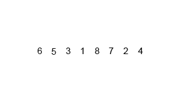

## Merge Sort

```c++
#include <iostream>
#include <algorithm>
using namespace std;

void merge(int arr[],int l,int m,int r){
    int n1 = m-l+1;
    int n2 = r-m;
    int a1[n1];
    int a2[n2];
    for(int i=0;i<n1;i++){
        a1[i] = arr[l+i];
    }    
    for(int i=0;i<n2;i++){
        a2[i] = arr[m+1+i];
    }
    int i=0;
    int j=0;
    int k=l;
    while(i<n1 && j<n2){
        if(a1[i]<a2[j]){
            arr[k] = a1[i];
            i++;
        }
        else{
            arr[k] = a2[j];
            j++;
        }
        k++;
    }
    while(i<n1){
        arr[k] = a1[i];
        i++;
        k++;
    }
    while(j<n2){
        arr[k] = a2[j];
        j++;
        k++;  
    }
}
void msort(int arr[],int l,int r){
    if (l<r){
        int m = (l+r)/2;
        msort(arr,l,m);
        msort(arr,m+1,r);
        merge(arr,l,m,r);
    }
}

```



** Сложность **

Временная сложноть: O(N*log2(N)) - даже в худшем случае

Пространственная:  O(N)

